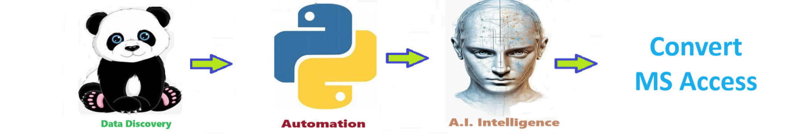
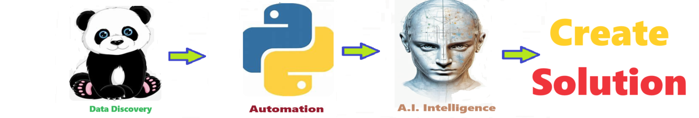

# Convert Ms Access To New Technology - Soltuion for converting MS access into a new technology stack. 
Soltuion for converting MS access into a new technology stack. 

Welcome to the solution **Convert Ms Access To New Technology** - an example for your projects

Soltuion for converting MS access into a new technology stack. 
## instructions # Convert MS Access 

## Description

Welcome to the ** onvert MS Access  ** solution 

Convert MS Access
by Josh Vangor and Joe Eberle started on 05-23-2023 - https://github.com/JoeEberle/ - josepheberle@outlook.com
Assessment and Planning:

Evaluate the existing Access system: Understand its functionality, data structure, user interface, and dependencies.
Identify pain points and limitations of the current system.
Define the objectives and requirements for the modernization project.
Data Migration:

Extract data from the Access database: Export tables, queries, and other relevant data.
Convert data to the format compatible with the new database system.
Import data into the new database management system (DBMS).
User Interface Redesign:

Design a new user interface: Consider usability, accessibility, and modern design principles.
Implement forms, reports, and other user interface components using modern web or desktop technologies.
Functionality Replication:

Analyze the functionality of the existing Access system: Identify key features and business logic.
Replicate functionality using the chosen modern technology stack: Develop new modules, workflows, and business logic.
Integration with External Systems:

Identify external systems and data sources that interact with the Access system.
Ensure seamless integration with external systems in the new tech stack.
Security Enhancements:

Assess security requirements: Implement authentication, authorization, and data encryption mechanisms.
Ensure compliance with security standards and regulations.
Performance Optimization:

Analyze performance bottlenecks in the existing Access system.
Optimize database queries, indexing, and data retrieval processes in the new system.
Testing and Quality Assurance:

Develop test cases to validate the functionality, usability, and performance of the new system.
Conduct thorough testing, including unit tests, integration tests, and user acceptance testing (UAT).
User Training and Documentation:

Provide training sessions for end-users: Familiarize them with the new system and its features.
Create documentation: Develop user manuals, guides, and tutorials to support users during the transition.
Deployment and Rollout:

Plan the deployment strategy: Decide whether to roll out the new system incrementally or all at once.
Execute the deployment plan: Install and configure the new system, migrate data, and deploy to production.
Post-Implementation Support:

Monitor system performance and user feedback after deployment.
Address any issues or bugs that arise: Provide ongoing support and maintenance as needed.
Continuously improve the system based on user feedback and evolving requirements.
Documentation and Knowledge Transfer:

Document the new system architecture, design decisions, and configuration details.
Ensure knowledge transfer: Share expertise and best practices with the development team and stakeholders.

## Features

- Easy to understand and use  
- Easily Configurable 
- Quickly start your project with pre-built templates
- Its Fast and Automated

## Notebook Features

- Self Documenting 
- Self Testing 
- Easily Configurable
- Includes Talking Code - The code explains itself
- Self Logging 
- Self Debugging 
- Low Code - or - No Code
- Educational 

## Getting Started

To get started with the ** Create Solution ** project, follow these steps:

1. Clone the repository to your local machine.
2. Install the required dependencies listed at the top of the notebook.
3. Explore the example code provided in the repository and experiment.
4. Run the notebook and your find your most Critical Data - EASY !

 

 

## Features
- Easy to understand and use  
- Easily Configurable 
- Quickly start your project with pre-built templates
- Its Fast and Automated

## Notebook Features
- **Self Documenting** - Automatically identifes major steps in notebook 
- **Self Testing** - Unit Testing for each ptyhon function
- **Easily Configurable** -easily modifyable with config.INI name value pairs
- **Includes Talking Code** - The code explains itself.
- **Self Logging** - enhanced python standard logging   
- **Self Debugging** - enhanced python standard debugging
- **Low Code - or - No Code** - Most solutions are under 50 lines of code
- **Educational** - Includes educational dialogue and background material
    
## Getting Started
To get started with the **Convert Ms Access To New Technology** solution repository, follow these steps:
1. Clone the repository to your local machine.
2. Install the required dependencies listed at the top of the notebook.
3. Explore the example code provided in the repository and experiment.
4. Run the notebook and make it your own - **EASY !**
    
## https://github.com/JoeEberle/ -- josepheberle@outlook.com 
    

          